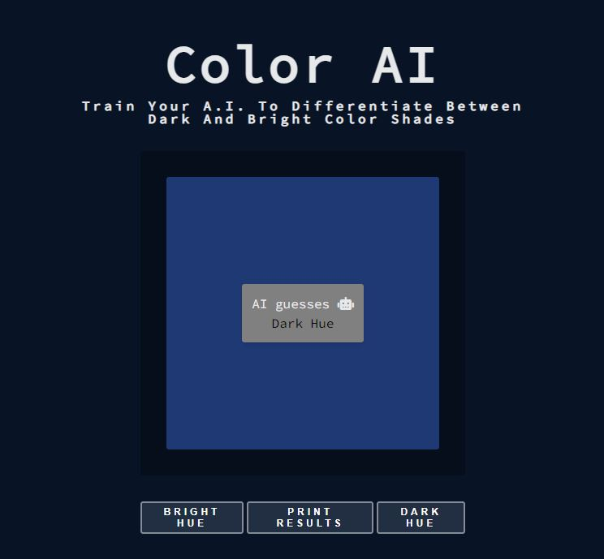

# Simple AI for color guessing

### Using the [brain.js](https://github.com/brainjs/brain.js) library 🤖

Simple AI which is able to differentiate between
brighter and darker colors, depending on your decisions during the training phase.

### js/data.js

Already contains some data for testing

### Feed new data

Simply run the application and use the left and right button to determine if the shown color is closer to being black or white.

Press the middle button for printing the accumulated data into the
console.
Copy and overwrite the existing data
